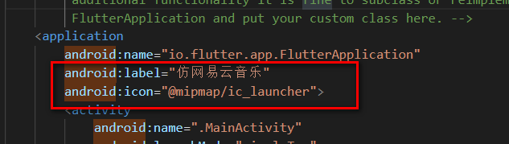
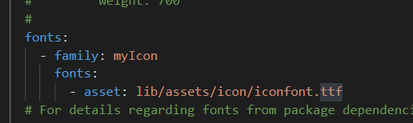
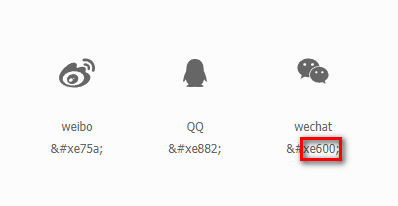
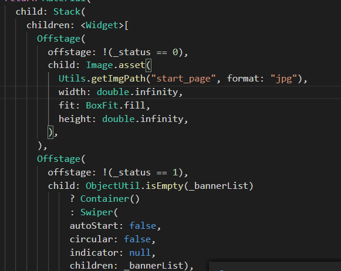

# 仿网易云音乐app分享
> 后端接口 https://binaryify.github.io/NeteaseCloudMusicApi/#/?id=neteasecloudmusicapi


### 一、 app名称及图标的修改
- 修改app名称
在项目下找到`Android`目录，（app -> src -> main -> AndroidManifest.xml），打开`AndroidManifest.xml`文件，找到`application`节点，修改`label`

- 修改app图标
在`app -> src -> main -> res`中`mipmap`开头目录中存放不同图标的大小。如果更换图标名称，则也需要在`AndroidManifest.xml`中修改`android:icon`对应的名字  
1. mipmap-hdpi - 72*72
2. mipmap-mdpi - 48*48
3. mipmap-xhdpi - 96*96
4. mipmap-xxhdpi - 144*144
5. mipmap-xxxhdpi - 192*192

### 二、 app启动页
>建议启动页内容在一个位置并居中显示，背景使用单色填充

在应用程序未初始化完成前的占位图。推荐使用透明图，并设置背景颜色，防止图片不能完全覆盖时，页面显示不协调。
使用方法： 打开`app -> src -> main -> res -> drawable -> launch_background.xml`文件增加
```xml
<item android:drawable="@android:color/white" />
<item>
    <bitmap android:gravity="center" android:src="@mipmap/launch_image" />
</item>
```
其中图片同样存放在图标所在位置，图片命名`launch_image`，如果修改图片名字，对应位置也要修改。其中xml代码中第一行为设置启动页背景颜色，
假如需要使用除黑白以外颜色，则需要在`values`文件夹中增加`colors.xml`
```xml
<?xml version="1.0" encoding="utf-8"?>
<resources>
    <color name="white">#FFFFFF</color>
    <color name="orange">#CC6633</color>
    <color name="transparent">#00000000</color>
</resources>
```
假如使用`orange`背景颜色则修改
```xml
<item android:drawable="@color/orange" />
```
### 三、使用自定义`icon`
1. 从`iconfont`下载文件，并将`iconfont.ttf`文件放到某个目录下。
2. 在`pubspec.yaml`配置fonts:  

3. 新建一个`myIcon.dart`文件,注册icon(其中的0xe600,是在unicode下将&#替换为0)
  
```
import 'package:flutter/cupertino.dart';
class MyIcons {
  static const IconData weChat =
      const IconData(0xe600, fontFamily: 'myIcon', matchTextDirection: true);
  static const IconData qq =
      const IconData(0xe882, fontFamily: 'myIcon', matchTextDirection: true);
  static const IconData weibo =
      const IconData(0xe75a, fontFamily: 'myIcon', matchTextDirection: true);
}
```
4. 使用
```dart
Padding(
    padding: EdgeInsets.all(0),
    child: Icon(
        MyIcons.weChat,
        color: Colors.white,
    ),
)
```


### 四、常用`Widget`
- 基础组件`Text`,`Image`,`Icon`,`Switch`,`Checkbox`,`TextField`,`LinearProgressIndicator`,`CircularProgressIndicator`，`Offstage`(通过offstage字段控制child是否显示)   


- 布局类`Row`,`Column`,`Flex`(类似Row),`Wrap`(从左到右排列，超过宽度自动换行),`Stack`（层叠布局），`Positioned`(通常和Stack同时使用)）
- - 状态管理(页面更新渲染)
- 容器组件 `Padding`,`Transform`(变形，变化角度),`Container`，`Scaffold`（页面整体结构），`AppBar`,`TabBar`,`TabBarView`,`Drawer`,`ClipRRect`
- 滚动组件 `SingleChildScrollView`(只能接收一个组件)，`ListView`，`GridView`,`CustomScrollView`(可以包含多种滚动)
- - `ScrollController`

### 五、常用包
地址： https://pub.dev/

1. `flutter_staggered_grid_view` 瀑布流式布局
2. `redux`,`flutter_redux` 状态管理
3. `dio` http请求库
4. `path_provider` 查找`iOS/Android`目录文件，通常和`IO`（对文件读写）模块同时使用
5. `cookie_jar` 保持回话持久
6. `flustars` flutter常用工具库
   - `SpUtil`同`SharedPreferences` 存储和读取永久性键值对，适合轻量存储(比如用户信息，登录信息)
   - `common_utils` Dart常用工具库类(包含日期，正则，倒计时，定时任务等) 
7. `image_picker` 从相册中的图片和用相机拍照


### 六、打包
1. 生成签名`keytool -genkey -alias demo.keystore -keyalg RSA -validity 40000 -keystore demo.keystore`其中demo为文件名(保持keystore文件的私密性，保存好签名文件后续如果签名文件与前版本签名的apk不一致的话会导致app更新问题)
2. 在`android`下新建文件`key.properties`文件，包含对密钥文件的引用  

**说明**
- -keystore 表示生成的签名文件的名称, 后期发布项目的是会用到该文件
- -alias 后续项目发布的时候也会用到, 可以根据自己的需要进行自定制
- -genkey 产生密钥
- -keyalg RSA 使用RSA算法对签名加密
- -validity 40000 有效期限4000天
```
storeFile=E:/flutter/flutter_music/demo.keystore
keyAlias=demo.keystore
storePassword=561610
keyPassword=561610
```
3. 详情查看 https://flutterchina.club/android-release/  配置

4. 运行`flutter build apk`

### 八、待完成
1. app通知
2. 动画
3. app更新升级
...

